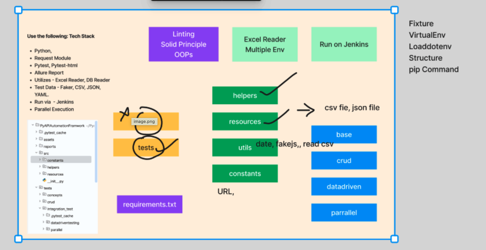

### Hybrid custom API Python Automation Framework

! [Screenshot](https://private-user-images.githubusercontent.com/1409610/354955159-3c7d5fe5-207a-42e7-84fe-f4d53354d987.png?jwt=eyJhbGciOiJIUzI1NiIsInR5cCI6IkpXVCJ9.eyJpc3MiOiJnaXRodWIuY29tIiwiYXVkIjoicmF3LmdpdGh1YnVzZXJjb250ZW50LmNvbSIsImtleSI6ImtleTUiLCJleHAiOjE3NDMxNTQwNjQsIm5iZiI6MTc0MzE1Mzc2NCwicGF0aCI6Ii8xNDA5NjEwLzM1NDk1NTE1OS0zYzdkNWZlNS0yMDdhLTQyZTctODRmZS1mNGQ1MzM1NGQ5ODcucG5nP1gtQW16LUFsZ29yaXRobT1BV1M0LUhNQUMtU0hBMjU2JlgtQW16LUNyZWRlbnRpYWw9QUtJQVZDT0RZTFNBNTNQUUs0WkElMkYyMDI1MDMyOCUyRnVzLWVhc3QtMSUyRnMzJTJGYXdzNF9yZXF1ZXN0JlgtQW16LURhdGU9MjAyNTAzMjhUMDkyMjQ0WiZYLUFtei1FeHBpcmVzPTMwMCZYLUFtei1TaWduYXR1cmU9NDY0ZjAzOTc2NWExMWVmM2QyN2ExZGM4OWM3ZWU4MjljZDA4MjZkYjUxNTk2ODAwYjU0MjkwZGZkNzdiMWEzNyZYLUFtei1TaWduZWRIZWFkZXJzPWhvc3QifQ.vlwefkblaYxCprwysDxKPcmg1xC0epKSgugxNTt28pM)

Tech Stack

-Python 3.12
-Requests - HTTP Requests
-PyTest - Testing Framework
-Reporting - Allure Report, PyTest HTML
-Test Data - CSV, Excel, JSON, Faker
-Advance API Testcase - jsonschema
-Parallel Execution - x distribute (xdist)

How to Install Packages
`pip install requests pytest pytest-html faker allure-pytest jsonschema` 

How to run your Testcase Parallel 
`pip install pytest-xdist`

How to run the Basic Test with Allure report
`pytest tests/tests/crud/test_create_booking.py  --alluredir=allure_result -s`
